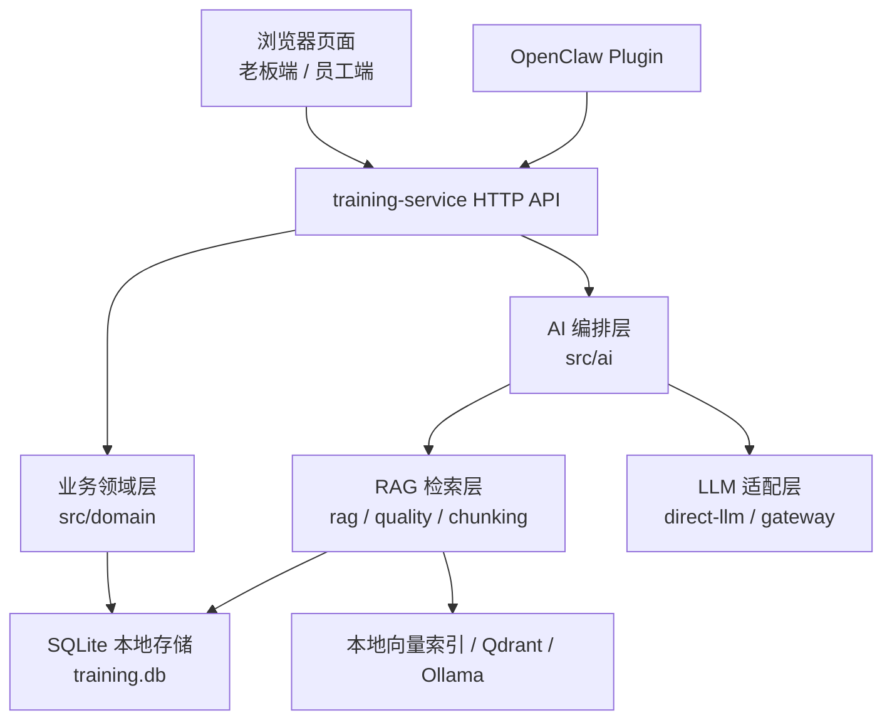
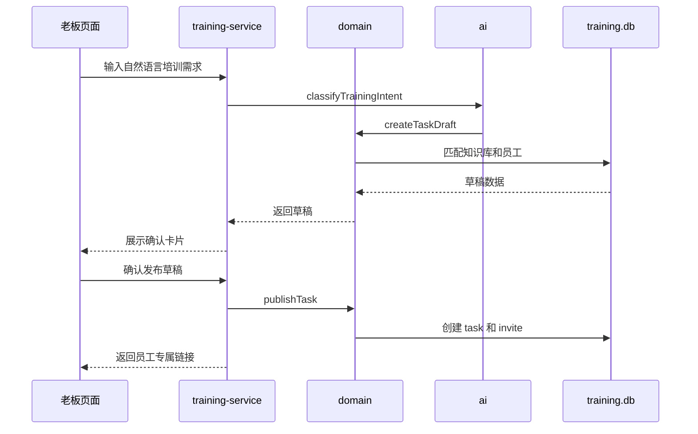
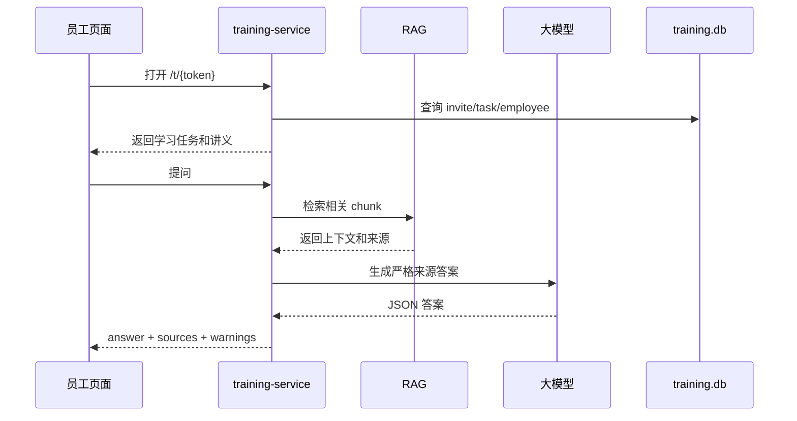
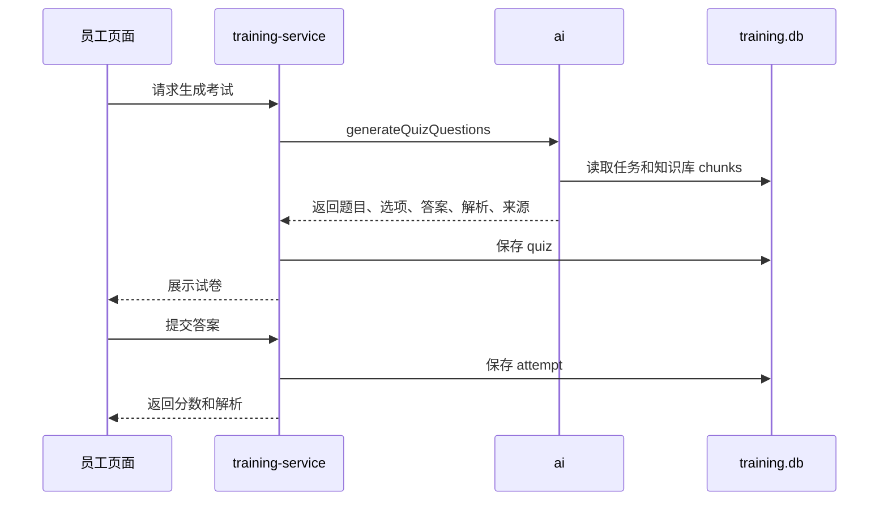

# 钜洲培训 Agent 项目总览文档

更新时间：2026-06-16
项目目录：`D:\juzhou-agent\peixun`  
业务数据目录：`D:\juzhou-agent\data`

## 1. 项目目标与背景

钜洲培训 Agent 是一个面向企业内部培训的轻量级智能培训系统。项目最初依托 OpenClaw 的 Agent 能力做自然语言培训编排，后来逐步独立为一个可单独部署、可连接大模型 API、可选接入 OpenClaw 插件的培训服务。

项目当前优先解决的不是通用聊天套壳，而是企业内部资料驱动的业务闭环：

- 老板或管理员用自然语言创建培训任务。
- 系统根据已有资料生成培训讲义、学习重点和考试题。
- 系统生成员工专属学习链接，员工打开链接完成学习、答疑、考试和提交。
- 老板查看任务完成率、未完成名单、分数分布和薄弱知识点。
- 资料来源、答案依据、题目解析都尽量可追溯，减少大模型胡编。
- 老板可基于本地知识库生成营销软文，但不保存文章列表。
- 老板端普通聊天、培训默认参数和软文偏好可使用本地记忆。

项目的核心背景是：企业里已有大量 PDF、表格、产品资料、销售话术、工艺说明和售后知识，但这些资料分散、质量参差不齐，人工做培训和出题成本较高。系统希望把“资料整理、培训发布、员工学习、考试验收、结果追踪”做成一个可落地的小型 Agent 应用。

## 2. 当前项目定位

当前项目定位为“企业培训 + 营销内容 Agent MVP”，不是完整的 OA、LMS 或大型多 Agent 平台。

当前重点：

- 培训资料导入与清洗。
- RAG 检索问答。
- 基于资料生成培训讲义。
- 基于资料生成考试题。
- 培训任务发布。
- 员工邀请链接。
- 考试提交与成绩统计。
- 营销软文生成。
- 本地短期会话记忆和长期偏好记忆。
- 服务端部署包和 Windows 便携包。

暂缓或只预留的能力：

- 小红书、公众号、企业微信等自动发布。
- 多 Agent 编排框架。
- MCP/SSE 对外工具服务。
- 完整企业身份认证。
- 大规模权限系统。
- 完整 OCR 平台。
- 报价、阿里发布、视频生成等外部业务 skill。

## 3. 总体设计原则

项目目前遵循以下设计原则：

1. 业务闭环优先  
   先把“发布培训、学习、答疑、考试、报表”跑稳，再扩展营销文章或外部发布。

2. 服务独立运行  
   `training-service` 可以在没有 OpenClaw 主仓库的情况下运行。OpenClaw 只作为可选插件宿主。

3. 数据与代码分离  
   源码放在 `D:\juzhou-agent\peixun`，真实业务数据放在 `D:\juzhou-agent\data`，避免把资料、索引、密钥和运行数据提交到 Git。

4. 大模型可替换  
   默认通过 OpenAI-compatible API 直连 DeepSeek、Kimi、OpenAI 等模型；OpenClaw Gateway 只作为显式启用的兼容 provider。

5. RAG 检索约束  
   本地向量索引、Qdrant、Ollama 不可用时，服务仍可回退 BM25 文本检索，不能因为语义检索离线导致业务完全不可用。

6. 来源可追溯  
   答疑、讲义和出题都尽量绑定 `sourceRef`，让用户知道内容来自哪份资料、哪个章节或 chunk。

## 4. 代码目录结构

当前主目录：

```text
D:\juzhou-agent\peixun
├── README.md
├── openclaw.training.example.json5
├── docs
│   └── PROJECT_OVERVIEW.md
├── deploy
│   └── server
│       ├── Dockerfile
│       ├── docker-compose.yml
│       ├── env.example
│       ├── README-server.md
│       ├── start-server.ps1
│       └── start-server.sh
├── dist
│   ├── JuzhouAgentTraining.zip
│   └── JuzhouAgentTrainingServer.zip
├── scripts
│   ├── package-server.ps1
│   └── package-windows.ps1
├── training-plugin
│   ├── README.md
│   ├── openclaw.plugin.json
│   └── src
│       ├── index.ts
│       ├── client.ts
│       ├── config.ts
│       ├── schemas.ts
│       └── tools.ts
└── training-service
    ├── package.json
    ├── public
    │   ├── index.html
    │   ├── app.js
    │   └── src
    │       ├── api.js
    │       ├── auth.js
    │       ├── bootstrap.js
    │       ├── chat.js
    │       ├── invite.js
    │       ├── imports.js
    │       ├── jobs.js
    │       ├── traces.js
    │       ├── chat
    │       ├── traces
    │       ├── messages.js
    │       └── ui.js
    ├── scripts
    │   ├── check-syntax.mjs
    │   ├── clean-raw.mjs
    │   ├── import-clean.mjs
    │   ├── embed-chunks.mjs
    │   ├── embed-local-index.mjs
    │   ├── eval-intent.mjs
    │   ├── eval-memory.mjs
    │   ├── eval-rag.mjs
    │   ├── qdrant-snapshot.mjs
    │   └── smoke-test.mjs
    └── src
        ├── server.mjs
        ├── http
        │   ├── app.mjs
        │   ├── api-router.mjs
        │   ├── auth.mjs
        │   ├── request.mjs
        │   ├── response.mjs
        │   ├── static.mjs
        │   └── controllers
        ├── store.mjs
        ├── domain
        │   ├── index.mjs
        │   ├── drafts.mjs
        │   ├── tasks.mjs
        │   ├── invites.mjs
        │   ├── quizzes.mjs
        │   ├── reports.mjs
        │   ├── answers.mjs
        │   ├── employees.mjs
        │   ├── knowledge.mjs
        │   └── common.mjs
        ├── rag.mjs
        ├── quality.mjs
        ├── chunking.mjs
        ├── health.mjs
        ├── intent-confirmation.mjs
        ├── agent-trace.mjs
        ├── agent
        │   ├── confirmation.mjs
        │   ├── run-lifecycle.mjs
        │   └── summaries.mjs
        ├── agent-runs
        │   ├── schema.mjs
        │   └── store.mjs
        ├── tools
        │   └── registry.mjs
        ├── direct-llm.mjs
        ├── llm.mjs
        ├── local-vector-index.mjs
        ├── qdrant.mjs
        ├── embedding.mjs
        ├── ai
        │   ├── config.mjs
        │   ├── context.mjs
        │   ├── core.mjs
        │   ├── llm-json.mjs
        │   ├── index.mjs
        │   ├── intent.mjs
        │   ├── marketing.mjs
        │   ├── material.mjs
        │   ├── answer.mjs
        │   ├── text-utils.mjs
        │   └── quiz.mjs
        ├── chat
        │   └── general-chat.mjs
        ├── memory
        │   ├── store.mjs
        │   ├── policy.mjs
        │   ├── extractor.mjs
        │   ├── retrieval.mjs
        │   ├── prompt.mjs
        │   ├── flow.mjs
        │   └── index.mjs
        ├── gateway
        │   ├── core.mjs
        │   ├── runtime.mjs
        │   ├── openclaw-client.mjs
        │   └── index.mjs
```

## 5. 技术选型

### 5.1 后端运行时

- Node.js，ES Module。
- 推荐 Node.js 24 或更新版本。
- 无 Express/Koa 等 Web 框架，当前使用 Node 原生 HTTP 服务。
- 优点是部署包小、依赖少、Windows Server 上启动简单。
- 缺点是随着接口增多，路由、中间件、错误处理会比成熟框架更容易变胖。

### 5.2 前端实现

- 纯静态页面：`training-service/public/index.html`、`training-service/public/app.js` 和 `public/src/*.js`。
- 无 React/Vue 构建链。
- 老板端和员工端共用一套前端入口，根据 URL 和接口数据切换视图。
- 优点是打包简单、部署简单。
- 当前已拆成浏览器 ES module，入口 `app.js` 只负责启动，聊天端、员工端、认证、API 和渲染工具分别维护。
- 老板端聊天对大模型普通回复和软文正文做安全 Markdown 渲染：先转义 HTML，再支持加粗、列表、标题、行内代码和代码块，避免 `**加粗**` 等模型格式直接暴露在界面上。
- 老板端聊天页左侧提供本地聊天记录列表，每条记录绑定独立 `sessionId` 并保存在浏览器 `localStorage`。页面加载时自动清理 30 天前的记录，聊天历史只用于前端回看，不进入培训任务、考试、知识库或长期记忆事实库。

### 5.3 数据存储

- 当前默认使用 SQLite 保存业务状态和本地长期记忆。
- 默认路径：`D:\juzhou-agent\data\training-index\training.db`。
- 可通过 `TRAINING_DATA_DIR` 覆盖数据目录，也可通过 `TRAINING_SQLITE_PATH` 指定数据库文件。
- `TRAINING_STORAGE=sqlite|json` 控制存储模式，默认 `sqlite`；`json` 用于临时回滚。
- 首次 SQLite 启动会从旧版 `state.json` 和 `memory.json` 导入，导入前保留 `.backup-时间戳.json`。
- `conversation-history.jsonl`、`agent-traces.jsonl`、JSON 模式 `agent-runs.jsonl`、本地向量索引和 Qdrant 不迁入业务 state，继续作为追加文件或治理索引存在。
- SQLite 内部 schemaVersion 当前为 4，新增 `jobs` 表保存异步导入和本地向量索引任务，新增 `knowledge_base_versions` 表保存知识库 current/previous 快照和文档级导入差异，新增 `agent_runs` / `agent_steps` 保存结构化运行治理记录；`state.json meta.version` 仍保持 1。
- 本地向量索引默认保存在同目录的 `vector-index-{model}.json`，例如 `vector-index-bge-m3.json`。

主要数据集合：

- `knowledgeBases`：知识库。
- `documents`：导入文档。
- `chunks`：RAG 检索单元。
- `employees`：员工。
- `tasks`：培训任务。
- `invites`：员工邀请链接。
- `quizzes`：试卷。
- `attempts`：考试提交记录。
- `contentDrafts`：后续文章/内容草稿预留。
- `events`：业务事件日志。
- `jobs`：异步任务队列，第一版覆盖知识库导入和本地向量索引重建。
- `knowledge_base_versions`：知识库版本快照，只保留当前版和上一版，用于导入差异查看和回滚。
- `agent_runs` / `agent_steps`：老板端 Agent 请求和步骤时间线，用于排查误判、确认门禁和工具调用路径。

本地运行文件：

- `training.db`：默认主数据库，保存业务集合和长期记忆集合。
- `training.db-shm` / `training.db-wal`：SQLite WAL 辅助文件，可能存在。
- `state.json`：旧版业务状态；首次迁移来源和 `npm run export:json` 导出目标。
- `memory.json`：长期偏好、短期会话摘要、待确认记忆和记忆状态。
- `conversation-history.jsonl`：老板端聊天消息和工具调用摘要，按 `sessionId` 追加。
- `agent-traces.jsonl`：意图路由、防误判确认和执行轨迹。
- `jobs.json`：JSON 回滚模式下的异步任务队列。
- `knowledge-base-versions.json`：JSON 回滚模式下的知识库 current/previous 快照和导入差异。
- `vector-index-bge-m3.json`：可选的本地向量索引，使用 local vector backend 时生成。

SQLite 采用“集合分表 + 完整 JSON 原文保留”的兼容方案，外层 domain/controller 仍通过 `loadState`、`saveState`、`mutateState` 和 memory store API 访问数据。这样既提升本地持久化可靠性，又保留 JSON 导出和回滚能力。正式多用户 SaaS 化时再考虑 PostgreSQL。

### 5.4 大模型调用

当前支持两条路径：

1. 直连 OpenAI-compatible API  
   通过环境变量配置：

   ```text
   TRAINING_LLM_PROVIDER=auto
   TRAINING_LLM_BASE_URL=https://api.deepseek.com/v1
   TRAINING_LLM_MODEL=deepseek-chat
   TRAINING_LLM_API_KEY=...
   ```

   也兼容：

   ```text
   DEEPSEEK_API_KEY
   DEEPSEEK_BASE_URL
   DEEPSEEK_MODEL
   OPENAI_API_KEY
   OPENAI_BASE_URL
   OPENAI_MODEL
   ```

2. OpenClaw Gateway  
   `training-service` 保留 WebSocket 调用 OpenClaw Gateway 的能力，但不再硬依赖 `D:\OpenClaw\openclaw`。
   默认 `TRAINING_LLM_PROVIDER=auto` 不再自动转 OpenClaw；需要兼容旧 Gateway 时显式设置 `TRAINING_LLM_PROVIDER=openclaw`。

默认建议：

- 服务器部署优先用直连模型 API。
- OpenClaw 作为可选 Agent 宿主。
- 老板端先做意图路由：发布培训、查询进度等培训意图进入系统内置技能；普通聊天只走直连大模型 API。
- 未配置 `TRAINING_LLM_API_KEY`、`DEEPSEEK_API_KEY` 或 `OPENAI_API_KEY` 时，普通聊天明确报配置缺失，不使用本地话术。

### 5.5 RAG 与向量检索

当前采用：

- 文本 chunk：本地切分。
- Embedding 模型：`bge-m3`。
- 向量后端：本地向量索引优先，Qdrant 可选。
- BM25 召回：内置 BM25 文本检索。
- 混合检索：向量语义召回 + BM25 召回。

推荐小服务器方案：

- 本机用 Ollama 跑 `bge-m3` 构建本地向量索引。
- 服务器只加载索引和业务数据。
- 2 核 4GB 服务器不建议长期运行大 embedding 模型和完整 Qdrant/Ollama 链路。

### 5.6 PDF 和资料处理

资料处理相关依赖：

- `pdfjs-dist@5.7.284`
- `@napi-rs/canvas@0.1.100`

脚本：

- `npm run clean:raw`：清洗原始资料。
- `npm run import:clean`：导入清洗后的 Markdown/TXT。
- `npm run render:pdf`：把扫描型 PDF 渲染为图片页，供后续 OCR 或视觉识别。
- `/imports`：老板端导入管理页，支持本机目录导入、浏览器上传、版本差异查看和上一版回滚。
- `/jobs`：老板端任务中心，查看导入、知识库回滚和本地向量索引任务状态、进度、错误和结果摘要。
- `/traces`：Agent Run / Trace 可视化页，查看结构化运行步骤、Tool Registry 和兼容 Trace 摘要。

当前限制：

- 可复制文本 PDF 可以自动抽取。
- 扫描型 PDF 暂时只能识别为 OCR 占位或渲染为图片，完整 OCR 仍需后续接入。
- 页面导入会进入异步任务队列；导入成功后 BM25 立即可用，并默认自动创建当前知识库的本地向量索引任务。embedding 失败不会回滚知识库，任务中心会显示失败原因。
- 每次成功导入会登记当前版和上一版快照，文档级 diff 能显示新增、删除和变更文件；回滚只恢复知识库内容，不影响培训任务、邀请、考试、记忆、Trace 或 Jobs。

### 5.7 部署与打包

部署模式：

- Windows Server 直接 Node 启动。
- Docker Compose 启动。
- Windows 绿色便携包。
- 服务器部署 ZIP。

打包脚本：

```powershell
powershell -ExecutionPolicy Bypass -File .\scripts\package-windows.ps1 -IncludeData
powershell -ExecutionPolicy Bypass -File .\scripts\package-server.ps1 -IncludeData
```

输出：

```text
dist\JuzhouAgentTraining.zip
dist\JuzhouAgentTraining-Setup.exe
dist\JuzhouAgentTrainingServer.zip
```

## 6. 实现框架

系统可以理解为 7 层：



### 6.1 Web/API 层

入口文件：

```text
training-service/src/server.mjs
training-service/src/http/app.mjs
training-service/src/http/api-router.mjs
```

职责：

- `server.mjs` 只负责读取端口/主机、创建 HTTP server 并启动。
- `src/http` 提供静态页面、认证、请求体解析、响应 helpers、API 路由和 controller。
- controller 调用领域层和 AI 层，不直接保存业务状态。
- 生成任务链接时根据请求地址或 `PUBLIC_BASE_URL` 拼接外部访问 URL。

主要接口：

```text
GET  /api/auth/status
POST /api/auth/login
POST /api/auth/logout
GET  /api/health
GET  /api/knowledge-bases
GET  /api/knowledge-bases/{id}/quality
GET  /api/knowledge-bases/{id}/versions
GET  /api/imports
POST /api/imports/directory
POST /api/imports/upload
GET  /api/reports/overview
GET  /api/employees
POST /api/agent/draft
POST /api/agent/dispatch
WS   /api/agent/stream
POST /api/chat
GET  /api/jobs
GET  /api/jobs/{jobId}
POST /api/jobs/{jobId}/cancel
POST /api/jobs/import/directory
POST /api/jobs/import/upload
POST /api/jobs/knowledge-bases/{id}/rollback
POST /api/jobs/embed
GET  /api/agent-runs
GET  /api/agent-runs/{runId}
GET  /api/tools/registry
GET  /api/traces
GET  /api/traces/{traceId}
GET  /api/memory
PATCH /api/memory/{memoryId}
DELETE /api/memory/{memoryId}
DELETE /api/memory
POST /api/tasks/publish
GET  /api/tasks
DELETE /api/tasks
GET  /api/tasks/{taskId}
GET  /api/invites/{token}
POST /api/answer
POST /api/quiz/generate
POST /api/quiz/submit
```

### 6.2 业务领域层

核心文件：

```text
training-service/src/domain/index.mjs
training-service/src/domain/drafts.mjs
training-service/src/domain/tasks.mjs
training-service/src/domain/invites.mjs
training-service/src/domain/quizzes.mjs
training-service/src/domain/reports.mjs
```

职责：

- 知识库列表。
- 员工搜索。
- 根据自然语言匹配知识库。
- 创建任务草稿。
- 发布任务。
- 生成邀请链接。
- 查询任务状态。
- 生成报表总览。
- 打开员工邀请。
- 调用答疑。
- 调用试卷生成。
- 提交考试成绩。
- 处理过期邀请和重复提交。

当前业务规则：

- 发布任务前必须有有效知识库和员工对象。
- 邀请链接可以按员工生成。
- 过期邀请不可继续提交。
- 重复提交以最后一次为准或在报表中取最新提交。
- 任务报表聚合完成率、未完成人员、平均分、分数分布和薄弱来源。

### 6.3 AI 编排层

核心目录：

```text
training-service/src/ai
```

当前拆分：

- `core.mjs`：兼容旧导入路径的轻量 re-export，不再承载核心实现。
- `config.mjs`：模型、思考强度、上下文长度和检索常量。
- `context.mjs`：RAG 上下文选择、父块渲染、来源规范化和检索模式摘要。
- `llm-json.mjs`：结构化 JSON 调用和修复。
- `index.mjs`：统一导出。
- `intent.mjs`：本地规则、LLM router、确认门禁前的意图归一化。
- `answer.mjs`：知识库答疑。
- `material.mjs`：培训讲义生成。
- `marketing.mjs`：营销软文生成。
- `quiz.mjs`：考试出题。
- `text-utils.mjs`：文本清洗、JSON 松散字段解析、模型缺失错误规范化。

职责：

- 判断老板自然语言意图。
- 生成培训草稿。
- 根据知识库生成培训讲义。
- 根据问题生成 RAG 答案。
- 根据任务生成考试题。
- LLM 不可用或解析失败时停止生成，并向接口返回清晰错误；不再用本地规则生成讲义、答案或题目。

### 6.4 本地记忆层

核心目录：

```text
training-service/src/memory
```

当前拆分：

- `store.mjs`：默认读写 SQLite 中的记忆集合，JSON 模式下读写 `memory.json`，并始终追加 `conversation-history.jsonl`。
- `policy.mjs`：判断哪些输入可记、待确认或禁止保存。
- `extractor.mjs`：从用户输入和执行结果中提取记忆候选。
- `retrieval.mjs`：按当前问题召回近期会话和长期偏好。
- `prompt.mjs`：把记忆安全注入普通聊天、意图识别、培训默认参数和软文偏好。
- `flow.mjs`：处理“查看记忆”“清空全部记忆”“保存/忽略记忆候选”等聊天动作。

记忆使用原则：

- 当前输入永远优先，记忆只补默认值，不覆盖明确指令。
- 长期记忆只保存低风险偏好，例如软文长度/渠道/口吻、培训默认题数和及格分、用户纠正过的工作方式。
- API Key、联系方式、成绩评价、删除/发布等高风险动作不自动保存。
- 模糊偏好先进入 `pending`，前端展示确认卡片；确认后才转为 `active`。
- 记忆不是事实库，产品参数、工艺、资料来源仍必须来自 RAG。

### 6.5 异步任务、Agent Run 与 Trace 层

核心目录：
```text
training-service/src/jobs
training-service/src/agent
training-service/src/agent-runs
training-service/src/tools
training-service/src/traces.mjs
```

职责：
- `jobs` 负责本地异步任务队列，第一版覆盖知识库导入、知识库回滚和本地向量索引重建。
- SQLite 模式下任务保存在 `training.db` 的 `jobs` 表，JSON 回滚模式下保存在 `jobs.json`。
- `/jobs` 页面展示任务状态、阶段进度、错误、结果摘要和取消操作。
- `agent` 保存 HTTP/WS 共用的确认校验、run 收尾和摘要逻辑，避免 stream 层反向依赖 controller。
- `agent-runs` 为每次 `/api/agent/dispatch`、`/api/agent/stream` 和 `/api/chat` 生成结构化 run，并按 step 记录 `memory_recall`、`intent_route`、`confirmation_verify`、`tool_execute`、`memory_write` 和 `result_output`；`schema.mjs` 是 `agent_runs` / `agent_steps` 建表逻辑的单一来源。
- `tools/registry.mjs` 统一登记网页端 5 个 skill 和 OpenClaw 8 个 training tool 的风险等级、确认要求、幂等性和服务端入口。
- `/traces` 页面同时展示 Agent Run、step 时间线、Tool Registry 和兼容 Trace 摘要；所有视图只展示脱敏消息预览、hash、摘要、耗时和错误。

### 6.6 RAG 检索层

核心文件：

```text
training-service/src/chunking.mjs
training-service/src/rag.mjs
training-service/src/quality.mjs
training-service/src/local-vector-index.mjs
training-service/src/qdrant.mjs
training-service/src/embedding.mjs
```

职责：

- 将 Markdown/TXT 切分为 chunk。
- 提取 chunk 元数据、来源引用、关键词。
- 过滤 OCR 占位、空文本、短文本和低价值 chunk。
- 进行 BM25 检索。
- 进行向量检索。
- 合并 BM25 分数和语义分数。
- 给模型提供去噪后的上下文。

### 6.7 LLM 适配层

核心文件：

```text
training-service/src/direct-llm.mjs
training-service/src/llm.mjs
training-service/src/chat/general-chat.mjs
training-service/src/gateway
```

职责：

- 直连 OpenAI-compatible 模型 API。
- 自动解析模型配置。
- 兼容 DeepSeek/Kimi/OpenAI 等服务。
- 处理部分模型只允许 `temperature=1` 的错误。
- 保留 OpenClaw Gateway WebSocket 调用能力。
- 普通聊天走直连大模型 API；培训讲义、答疑和出题也必须依赖可用模型 API，模型不可用时直接失败。

### 6.8 数据存储层

核心文件：

```text
training-service/src/store.mjs
training-service/src/knowledge-base-versions.mjs
training-service/src/agent-runs/store.mjs
```

职责：

- 确认数据目录存在。
- 根据 `TRAINING_STORAGE` 加载 SQLite 或 JSON 状态。
- 初始化默认 state。
- 保存 state，SQLite 模式写入 `training.db`，JSON 模式写入 `state.json`。
- 保存异步任务，SQLite 模式写入 `training.db`，JSON 模式写入 `jobs.json`。
- 保存知识库版本，SQLite 模式写入 `knowledge_base_versions` 表，JSON 模式写入 `knowledge-base-versions.json`。
- 知识库版本只保留 current/previous 两份快照，覆盖 knowledgeBase、documents、chunkParents 和 chunks。
- 保存 Agent Run，SQLite 模式写入 `agent_runs` / `agent_steps`，JSON 模式追加 `agent-runs.jsonl`。
- 提供 mutation 辅助。
- 生成 ID 和 token。
- 记录事件。

### 6.9 OpenClaw 插件层

目录：

```text
training-plugin
```

内部结构：

```text
training-plugin/src/index.ts   # 插件入口，只注册工具
training-plugin/src/client.ts  # 调用 training-service
training-plugin/src/config.ts  # 插件配置和 token 读取
training-plugin/src/schemas.ts # 工具参数 schema helper
training-plugin/src/tools.ts   # 8 个 tool 定义
```

插件暴露的工具名保持不变：

```text
training_list_knowledge_bases
training_search_employees
training_create_task_draft
training_publish_task
training_get_task_status
training_answer_question
training_generate_quiz
training_grade_answer
```

插件只代理调用 `training-service`，不保存核心业务数据。这样即使不安装 OpenClaw，网页端和服务端也能正常工作。

## 7. 核心业务流程

### 7.1 老板发布培训



### 7.2 员工学习与答疑



### 7.3 生成考试与提交



### 7.4 Agent 防误判与确认链路

老板端聊天入口不会让模型直接执行所有动作。当前路由链路是：

```text
用户输入
  -> 本地规则初判
  -> 可选 LLM JSON router
  -> 置信度 / 风险门控
  -> 确认卡片或执行 skill
  -> 写入 Agent Run step 和兼容 agent-traces.jsonl
```

关键约束：

- 删除培训记录属于高风险操作，即使命中本地规则也必须二次确认。
- 低置信操作意图返回 `intent_confirm`，前端可选择“确认执行 / 当普通聊天 / 重新输入”。
- LLM 单独识别出的操作意图，如果本地规则没有支持，会先要求确认，避免模型过度调用工具。
- 确认卡片携带服务端签发的 `confirmationToken`，token 绑定原始消息和 skill，默认 15 分钟过期。
- 后端执行 `confirmedSkill` 前会校验 token；缺 token、过期、换消息或换 skill 都拒绝执行。
- `/api/agent/dispatch`、`/api/agent/stream` 和 `/api/chat` 会生成 Agent Run，记录记忆召回、意图路由、确认校验、tool 执行、记忆写入和结果输出。
- 兼容 Trace 继续写入数据目录的 `agent-traces.jsonl`，并携带 `runId`，方便从旧摘要跳转到结构化 run。
- `/traces` 页面、`/api/agent-runs` 和 `/api/traces` 只读取脱敏摘要，不展示完整聊天内容或 API Key。

### 7.5 记忆写入与使用链路

老板端浏览器会在 `localStorage` 生成并复用 `sessionId`。`/api/agent/dispatch`、`/api/agent/stream`、`/api/chat` 支持传入 `sessionId` 和 `memoryMode`：

```text
用户输入
  -> 读取最近会话和相关长期记忆
  -> 判断是否为记忆管理命令
  -> 注入普通聊天 / 意图识别 / skill 默认参数
  -> 执行聊天或 skill
  -> 提取低风险记忆候选
  -> active 直接保存，pending 展示确认卡片
  -> 追加 conversation-history.jsonl
```

当前用途：

- 普通聊天：补充最近上下文和用户长期偏好。
- 培训草稿：用户没明确写题数/及格分时，使用记忆里的默认题数和默认及格分。
- 营销软文：用户没明确写渠道/长度/口吻时，使用记忆里的软文偏好。
- 意图识别：把“用户曾纠正过的工作方式”作为辅助提示，但不让记忆直接触发发布、删除等高风险动作。

记忆管理接口：

```text
GET    /api/memory
PATCH  /api/memory/{memoryId}
DELETE /api/memory/{memoryId}
DELETE /api/memory
```

清空全部记忆属于高风险动作，必须先通过聊天入口获得确认 token，再调用 `DELETE /api/memory`。

## 8. RAG 策略

### 8.1 业务语义切片与 Parent-Child

导入清洗资料时，`scripts/import-clean.mjs` 会调用 `src/semantic-chunking.mjs`。当前结构是“小 child 检索，大 parent 生成”：

- `chunkParents` 保存完整业务语义父块，例如知识点、型号/系列、表格行、问答案例。
- `chunks` 继续作为检索子块，并保存 `parentId`、`childType`、`businessKeys`、`searchText`。
- 表格行和型号参数优先保持为完整父块，不再把一行业务记录拆散。
- 普通知识点父块会拆成较小 child；当前默认 child 上限约 720 字符，重叠约 60 字符。
- 非 Markdown 或无法识别标题结构的资料会走兼容切片兜底，旧数据中没有 `parentId` 的 chunk 仍可被检索和生成使用。

训练讲义、员工答疑、考试出题和营销软文都使用 `searchKnowledgeContexts` 返回的父块上下文，而不是只把零散 child 直接交给模型。

### 8.2 资料质量控制

导入和检索时会识别：

- 空 chunk。
- OCR 占位 chunk。
- 过短 chunk。
- 来源缺失 chunk。
- 只有页码/标题/来源文件的低价值 chunk。

知识库质量接口：

```text
GET /api/knowledge-bases/{id}/quality
```

用于老板端发布前提示资料风险，例如：

- 文档数量。
- chunk 数量。
- 可用 chunk 数量。
- OCR 占位数量。
- 短文本数量。
- 向量索引状态。
- parent-child 父块数量、孤儿子块、最长子块长度。

### 8.3 检索策略

当前检索链路：

1. 根据知识库 ID 和问题过滤可用 child chunk。
2. BM25 检索召回 child。
3. 如果配置可用，执行本地向量索引或 Qdrant 语义召回 child。
4. 合并 BM25 分数和语义分数；默认权重来自 `TRAINING_BM25_WEIGHT` 和 `TRAINING_SEMANTIC_WEIGHT`，参数/型号类问题会提高 BM25 权重。
5. 同一 child 同时命中 BM25 和向量时标记为 hybrid。
6. 通过 `parentId` 展开父块，多个 child 命中同一 parent 时去重。
7. 根据问题类型做上下文去噪。
8. 只把少量高质量父块上下文传给模型。

问题类型倾向：

- 参数查询：优先保留包含完整字段和值的参数表 chunk。
- 工艺/质量：优先保留正文型说明 chunk。
- 销售话术：优先保留话术、客户沟通、场景应用类 chunk。

### 8.4 防止模型幻觉

项目使用多层机制减少幻觉：

1. 输入前过滤  
   OCR 占位、空资料、过短 chunk 不进入模型上下文。

2. 上下文限制  
   不把整篇资料丢给模型，只给命中的少量 chunk。

3. 强约束 prompt  
   答疑要求模型只基于提供资料回答，不补充外部事实，不写营销扩展，不大段复制原文。

4. JSON 输出校验  
   模型必须返回结构化 JSON，包含答案、来源、置信提示等字段。

5. 来源白名单  
   模型返回的 `sourceRef` 必须来自本次命中的 chunk。编造的来源不会被采纳。

6. 模型不可用时停止输出  
   LLM 不可用或解析失败时，不生成讲义、答案或题目，并返回明确配置错误。

7. 答案质量标记  
   `/api/answer` 返回：

   ```text
   retrievalMode
   usedSources
   answerQuality
   warnings
   ```

8. RAG 评测脚本  
   固定问题检查 Top1/Top3 命中率、答案来源、长度、OCR 占位等。

运行：

```powershell
cd D:\juzhou-agent\peixun\training-service
npm run eval:rag
```

## 9. 健康检查与运行状态

健康检查接口：

```text
GET /api/health
```

返回核心状态：

- `stateOk`：状态存储是否可加载。
- `qdrantOk`：Qdrant 是否可访问。
- `ollamaOk`：Ollama 是否可访问。
- `localVectorIndexOk`：本地向量索引是否可用。
- `openclawRuntimeOk`：OpenClaw runtime 是否可用。
- `llmProvider`：当前 LLM 提供方。
- `llmConfigured`：LLM 是否配置完成。
- `retrievalMode`：`hybrid`、`bm25` 或兼容旧实现时的 `keyword-legacy`。
- `dataDir`：当前数据目录。
- `storage`：当前存储模式、SQLite/JSON 路径和文件是否存在。

这个接口用于确认：

- 服务是否启动。
- 数据目录是否正确。
- 当前是混合检索还是 BM25 检索。
- 大模型是否可用。
- 是否还依赖 OpenClaw Gateway。

## 10. 部署架构

### 10.1 本地开发模式

```powershell
cd D:\juzhou-agent\peixun\training-service
npm install
npm start
```

访问：

```text
http://127.0.0.1:8787/
```

### 10.2 Windows Server 直接部署

适合当前阿里云 Windows ECS：

1. 安装 Node.js 24。
2. 上传 `JuzhouAgentTrainingServer.zip`。
3. 解压到服务器目录。
4. 复制 `.env.example` 为 `.env`。
5. 配置访问密钥、模型 API Key、外部访问地址。
6. 运行 `start-server.ps1`。
7. 安全组放行 `8787` 或通过反向代理映射到 80/443。

关键配置示例：

```text
HOST_PORT=8787
PUBLIC_BASE_URL=http://服务器IP:8787
PUBLIC_BASE_URL_MODE=request
TRAINING_ACCESS_KEY=长随机登录密钥
TRAINING_STORAGE=sqlite
TRAINING_SQLITE_BUSY_TIMEOUT_MS=5000
TRAINING_LLM_PROVIDER=auto
TRAINING_LLM_BASE_URL=https://api.deepseek.com/v1
TRAINING_LLM_MODEL=deepseek-chat
TRAINING_LLM_API_KEY=...
TRAINING_HYBRID_RETRIEVAL=auto
TRAINING_VECTOR_BACKEND=local
```

### 10.3 Docker 部署

部署包包含：

```text
deploy/server/Dockerfile
deploy/server/docker-compose.yml
deploy/server/env.example
```

启动：

```bash
docker compose up -d --build
```

2 核 4GB 服务器可以安装 Docker，但不建议同时运行太多服务。当前培训服务本身较轻，真正消耗资源的是 Ollama、embedding 和 Qdrant。

### 10.4 OpenClaw 插件模式

OpenClaw 插件配置路径：

```text
D:/juzhou-agent/peixun/training-plugin
```

配置示例：

```json5
{
  plugins: {
    load: {
      paths: ["D:/juzhou-agent/peixun/training-plugin"],
    },
    entries: {
      "training-rag": {
        enabled: true,
        config: {
          serviceUrl: "http://127.0.0.1:8787",
          timeoutMs: 20000,
        },
      },
    },
  },
}
```

OpenClaw 只负责把工具暴露给 Agent，核心培训逻辑仍在 `training-service`。

### 10.5 备份与迁移

生产或试用环境至少需要备份：

```text
training.db
training.db-shm
training.db-wal
conversation-history.jsonl
agent-traces.jsonl
agent-runs.jsonl
vector-index-bge-m3.json
```

当前提供运行数据备份命令：

```powershell
npm run backup:data
npm run backup:verify -- --from <backup.zip>
npm run restore:data -- --from <backup.zip> --force
```

`backup:data` 默认输出到 `TRAINING_DATA_DIR\backups`。备份包包含通过 SQLite backup API 生成的 `training.db` 快照、`state.json` / `memory.json` 回滚副本、聊天/路由 JSONL、JSON 模式任务队列、JSON 模式知识库版本文件、本地向量索引和 `manifest.json` 校验清单。恢复默认只校验，必须加 `--force` 才会覆盖；覆盖前脚本会自动为当前数据生成一份安全备份。恢复前建议先停止服务。

如果使用 Qdrant，还需要额外备份 Qdrant volume 或 collection snapshot；如果只使用 BM25，则没有向量索引也能运行，但语义召回会下降。清洗后的资料目录 `training-clean` 也建议一起保留，方便重建 SQLite 数据、Qdrant 或本地向量索引。

## 11. 关键环境变量

| 变量 | 作用 | 推荐值 |
| --- | --- | --- |
| `HOST_PORT` / `TRAINING_SERVICE_PORT` | 服务端口 | `8787` |
| `PUBLIC_BASE_URL` | 对外生成链接的基础地址 | `http://服务器IP:8787` 或域名 |
| `PUBLIC_BASE_URL_MODE` | 链接生成模式 | `request` 或 `env` |
| `TRAINING_ACCESS_KEY` | 网页登录密钥 | 长随机字符串 |
| `TRAINING_AUTH_DISABLED` | 是否关闭登录校验 | 生产不要开启 |
| `TRAINING_DATA_DIR` | 业务状态、记忆、路由轨迹和本地向量索引目录 | `D:\juzhou-agent\data\training-index` |
| `TRAINING_STORAGE` | 主存储模式 | `sqlite`，回滚时设为 `json` |
| `TRAINING_SQLITE_PATH` | SQLite 数据库路径 | 默认 `${TRAINING_DATA_DIR}/training.db` |
| `TRAINING_SQLITE_BUSY_TIMEOUT_MS` | SQLite 忙等待超时 | `5000` |
| `TRAINING_JOB_CONCURRENCY` | 本地异步任务并发数 | `1` |
| `TRAINING_DATA_ROOT` | 项目业务数据根目录 | `D:\juzhou-agent\data` |
| `TRAINING_LLM_PROVIDER` | LLM 提供方；`auto` 默认走 OpenAI-compatible API，OpenClaw 需显式设为 `openclaw` | `auto` |
| `TRAINING_LLM_BASE_URL` | 模型 API 地址 | `https://api.deepseek.com/v1` |
| `TRAINING_LLM_MODEL` | 模型名 | `deepseek-chat` 或兼容模型 |
| `TRAINING_LLM_API_KEY` | 模型 API Key | 生产密钥 |
| `TRAINING_LLM_TEMPERATURE` | 生成温度 | `0.2`，特殊模型会自动重试 `1` |
| `TRAINING_HYBRID_RETRIEVAL` | 是否启用混合检索 | `auto` / `on` / `off` |
| `TRAINING_VECTOR_BACKEND` | 向量后端 | `local` |
| `TRAINING_BM25_WEIGHT` | BM25 融合权重 | `0.45` |
| `TRAINING_SEMANTIC_WEIGHT` | 向量融合权重 | `0.55` |
| `TRAINING_EMBEDDING_MODEL` | embedding 模型 | `bge-m3` |
| `OLLAMA_URL` | Ollama 地址 | `http://127.0.0.1:11434` |
| `QDRANT_URL` | Qdrant 地址 | `http://127.0.0.1:6333` |
| `QDRANT_COLLECTION` | Qdrant collection | `training_chunks_bge_m3` |
| `OPENCLAW_GATEWAY_URL` | OpenClaw Gateway | 可选 |
| `OPENCLAW_GATEWAY_TOKEN` | OpenClaw Gateway Token | 可选 |

## 12. 测试与验收

### 12.1 代码检查

```powershell
cd D:\juzhou-agent\peixun\training-service
npm run check
```

`npm run check` 会自动扫描 `src`、`public`、`scripts` 下的 `.mjs` 和 `.js` 文件执行 `node --check`，新增模块不需要手动追加到长命令中。

### 12.2 SQLite、备份和导入评测

```powershell
npm run eval:sqlite
npm run migrate:sqlite -- --dry
npm run migrate:sqlite
npm run eval:backup
npm run eval:import
npm run eval:jobs
npm run eval:kb-versions
npm run eval:traces
npm run eval:agent-trajectory
```

`eval:sqlite` 使用临时目录验证 JSON 导入、SQLite 读写、记忆迁移和 JSON 导出。`eval:backup` 使用临时目录验证备份、校验、无 `--force` 恢复演练、强制恢复和恢复后可读性。`eval:import` 验证同步导入服务。`eval:jobs` 验证异步导入、自动 embedding 子任务、取消、重启恢复和 JSON 任务存储。`eval:kb-versions` 验证知识库 current/previous 快照、文档级 diff、异步回滚和 JSON 版本文件。`eval:traces` 验证脱敏 Trace 读取和过滤。`eval:agent-trajectory` 验证 Agent Run step、Tool Registry、确认门禁和禁止误执行的负例。`migrate:sqlite` 面向当前 `TRAINING_DATA_DIR`，执行前会保留原 `state.json` / `memory.json` 备份。

### 12.3 业务烟测

```powershell
npm run smoke
```

覆盖内容：

- 加载状态文件。
- 发布培训任务。
- 打开邀请链接。
- 答疑。
- 生成考试。
- 提交成绩。
- 报表汇总。
- 软文生成。
- 培训记录删除确认。
- 记忆保存、默认参数生效和清空记忆确认。

### 12.4 RAG 评测

```powershell
npm run eval:rag
npm run eval:rag -- --retrieval-only
```

默认回归优先使用 `--retrieval-only`，避免把大模型生成波动混入检索质量判断。评测用例维护在 `training-service/scripts/fixtures/rag-eval-cases.mjs`，当前固定 30 条电机业务问题，并按 category 输出统计。

评测方向：

- Top1 命中率。
- Top3 命中率。
- Hybrid Top1 是否不低于 BM25-only。
- 型号参数、结构原理、制造工艺、销售场景、多语言资料的分类命中情况。
- 答案是否包含来源。
- 答案是否为空。
- 答案是否过长。
- 是否出现 OCR 占位。

固定问题包括：

- 型号参数表：YE2/YE3/YE4/YE5、IE2/IE3/IE4/IE5、级数、机座范围和功率范围。
- 结构原理：三相异步电动机结构、铭牌字段、选型条件、异步转速、定子绕组作用。
- 制造质量：附加损耗与三种铸铝方式、断条检测、铁损检测、槽型、三径/槽配合/斜槽、线圈张紧力。
- 销售与软文资料：WONDER 系列、产品介绍方法、客户价值表达。
- 多语言与标准：英文 IE3 定转子参数表、IEC/GB 能效标准、英文工艺名对应中文工艺。

### 12.5 意图与记忆评测

```powershell
npm run eval:intent
npm run eval:memory
```

`eval:intent` 覆盖培训发布、重新输入、确认发布、进度查询、删除确认、软文和普通聊天边界。

`eval:memory` 覆盖：

- “以后软文默认短一点，偏公众号”保存为长期偏好。
- 新会话软文生成能召回该偏好。
- “这次写长一点”覆盖默认记忆但不删除记忆。
- “以后培训默认 10 道题 80 分”影响培训草稿默认参数。
- API Key、删除培训记录等高风险内容不会写入长期记忆。
- 模糊偏好进入 pending，确认 token 后才保存。
- 记忆列表、删除和清空 API 正常工作。

### 12.6 人工验收

建议每次资料导入后人工确认：

- 老板端能看到知识库质量风险。
- 资料质量差时系统不会强行发布或误导。
- 员工端学习内容不是乱码或大段原文。
- 答疑答案能看到来源。
- 出题不出现 OCR 占位。
- 题干不是直接截取资料长句。
- 解析说明为什么正确，并包含来源。
- 员工提交后报表数据正常更新。

## 13. 当前已知问题与风险

### 13.1 资料质量仍是最大风险

真实数据中存在扫描型 PDF，直接抽取会得到 OCR 占位或空文本。即使 RAG 逻辑做了过滤，如果某个知识库可用 chunk 太少，答案和试题质量仍会下降。

建议：

- 对扫描型 PDF 做 OCR。
- 导入后查看知识库质量报告。
- 使用 `npm run eval:rag` 做固定问题回归。

### 13.2 SQLite 仍不是正式 SaaS 数据库

当前已经默认使用 SQLite 替代 `state.json` 和 `memory.json` 作为主存储，解决了 JSON 文件在并发写入、局部查询和迁移回滚上的短板。但 SQLite 仍是单机本地数据库，不等同于正式多租户 SaaS 数据库。

后续建议：

- 小规模单机部署继续使用 SQLite。
- 保留 `TRAINING_STORAGE=json` 和 `npm run export:json` 作为回滚能力。
- 正式多用户 SaaS 化时迁移 PostgreSQL。

### 13.3 记忆不是业务事实库

记忆模块用于“用户偏好”和“会话连续性”，不应该作为产品事实、报价事实或培训资料事实来源。后续接入更多业务 skill 时仍需保持：

- 产品参数、工艺信息、资料来源来自 RAG 知识库。
- 报价、发布、删除、成绩等高风险动作不能由记忆自动触发。
- 用户可查看、确认、归档、删除记忆。
- 敏感信息过滤规则需要持续随真实输入补充。

### 13.4 前端模块边界仍需继续维护

`public/app.js` 已拆成无构建浏览器 ES module：

```text
public/src/api.js
public/src/auth.js
public/src/bootstrap.js
public/src/chat.js
public/src/chat/session.js
public/src/chat/renderers.js
public/src/chat/memory-actions.js
public/src/invite.js
public/src/imports.js
public/src/jobs.js
public/src/traces.js
public/src/traces/renderers.js
public/src/messages.js
public/src/ui.js
```

聊天页当前按 session/body、纯渲染、记忆交互和入口编排拆分；Trace 页按入口编排和 Run/Trace/Tool 渲染拆分。后续如果页面继续增加，应继续按老板端、员工端、共享渲染组件和 API client 的边界拆分，而不是重新把逻辑堆回入口文件。

### 13.5 登录密钥不是完整账号体系

当前 `TRAINING_ACCESS_KEY` 是共享登录密钥，适合内部小范围使用。正式上线需要：

- 管理员账号。
- 员工身份绑定。
- 邀请链接权限控制。
- 操作审计。

### 13.6 大模型仍可能出现表达偏差

项目已通过 RAG、来源白名单、结构化校验、确认 token、路由轨迹和评测减少幻觉与误执行，但不能保证模型每句话都完全正确。更严格的下一步是：

- 答案句子级引用。
- unsupported claim checker。
- 低置信度强制返回“资料不足”。
- 前端展示关键来源片段，方便人工核验。
- 持续把真实误判样本加入 `eval:intent` 和 `eval:rag`。

## 14. 后续优化路线

### 14.1 短期优先级

1. 完善 OCR 流程  
   把扫描型 PDF 转成可用 Markdown，减少资料空洞。

2. 增强 RAG 评测  
   扩展到 30-50 个企业常见问题，形成稳定回归集。

3. 增加 reranker 或二阶段重排
   在 BM25 + 向量召回之后，对 TopN parent 做更精细排序，减少噪声。

4. 优化前端资料质量提示
   发布前更明确地提示“哪些资料不可用、哪些来源未入向量库”。

5. 强化试题质量
   增加题目难度、知识点覆盖率和重复率控制。

6. 部署备份脚本
   已提供第一版运行数据备份/恢复脚本；后续可继续增加定时备份、保留周期和 Qdrant snapshot 自动化。

### 14.2 中期优化

1. 数据库治理
   在 SQLite 基础上补充更细的索引、迁移脚本、备份恢复脚本和数据校验；正式 SaaS 化时再迁移 PostgreSQL。

2. 账号体系  
   管理员、员工、部门、角色权限。

3. 知识库版本追溯增强
   当前已支持 current/previous 快照、文档级导入差异和上一版回滚；后续可扩展到长期版本审计，并让考试和答案绑定具体知识库版本。

4. 任务通知  
   接入企业微信、短信或邮件。

5. 报价 skill
   把已有报价系统作为独立服务接入，通过 HTTP API 生成报价和报价单。

### 14.3 长期方向

1. 内容草稿能力  
   使用 `contentDrafts` 做“草稿-确认-发布”流程，为小红书、公众号、官网文章预留。

2. 多租户或多公司  
   如果未来服务更多公司，需要隔离数据、密钥和知识库。

3. 多 Agent 工作流  
   在培训闭环稳定后，再考虑课程规划 Agent、题库审核 Agent、资料质检 Agent。

4. 更强知识治理  
   包括资料审核、过期知识提醒、来源可信度评分和人工标注。

## 15. 项目当前结论

钜洲培训 Agent 当前已经具备一个可落地的企业培训系统雏形：

- 能独立于 OpenClaw 主仓库运行。
- 能通过网页完成培训发布、学习、答疑、考试和报表。
- 能通过 OpenClaw 插件暴露 8 个培训工具。
- 能使用直连大模型 API 完成讲义和试题生成。
- 能使用 `bge-m3 + 本地向量索引或 Qdrant + BM25 hybrid` 做资料问答。
- 能在向量服务不可用时回退 BM25 检索。
- 能用本地记忆改善老板端普通聊天、培训默认参数和软文风格偏好。
- 能打包为 Windows 便携包和服务器部署包。

当前最关键的优化点仍然是资料质量，尤其是扫描型 PDF 的 OCR 和清洗。只要资料质量稳定，现有架构已经可以支撑内部培训 MVP 上线试用。
